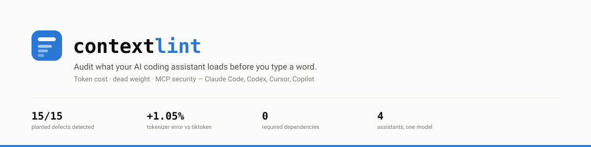
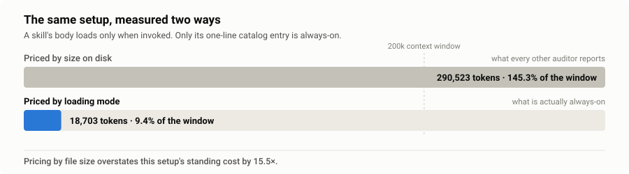
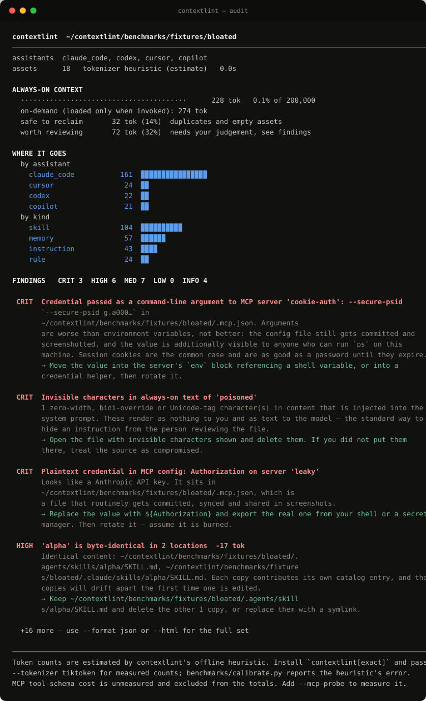
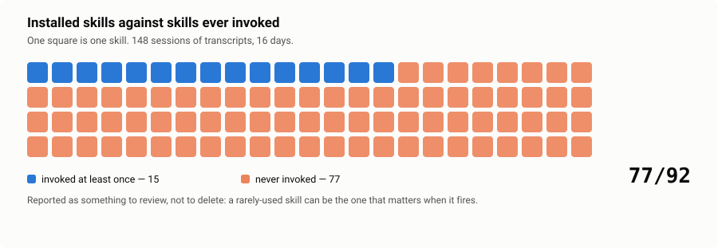
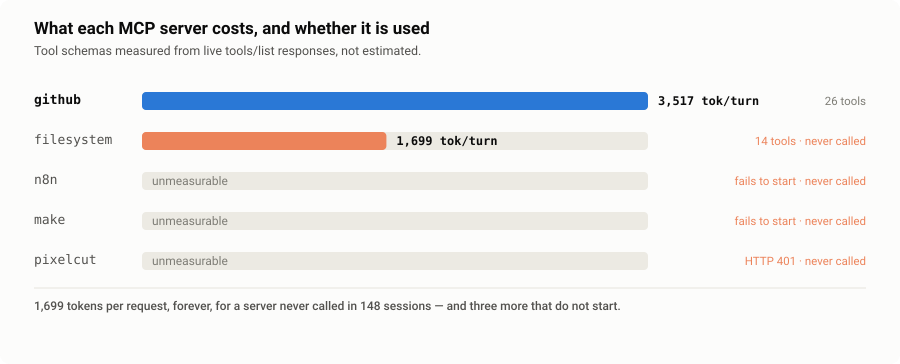
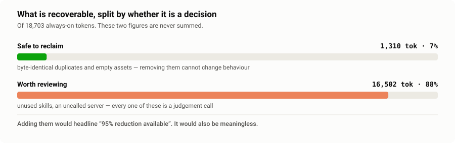
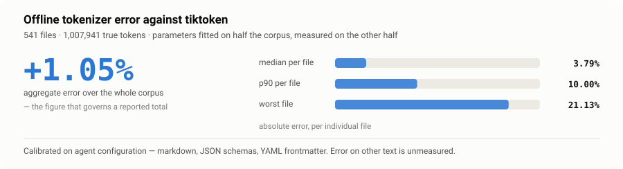

<div align="center">

<picture>
  <source media="(prefers-color-scheme: dark)" srcset="docs/assets/hero-dark.svg">
  
</picture>

<p>
  <a href="https://github.com/dorkian/contextlint/actions/workflows/ci.yml"></a>
  
  
  
  
</p>

```bash
uvx --from git+https://github.com/dorkian/contextlint contextlint
```

<sub>No API key. No network. No telemetry. No dependencies.</sub>

</div>

---

## The problem in one chart

Every skill, instruction file and MCP tool schema your assistant loads is injected into the system prompt before your first message. You pay for it on every request, including the ones where none of it is relevant.

Existing tools price a skill by its size on disk. But a well-formed skill's body only loads when it is invoked — what you pay every turn is its one-line catalog entry. Conflate the two and you are wrong by an order of magnitude, in the direction that flatters the savings claim.

<picture>
  <source media="(prefers-color-scheme: dark)" srcset="docs/assets/cost-model-dark.svg">
  
</picture>

contextlint separates the two, prices them independently, and refuses to add together numbers that mean different things.

## What it looks like



`--html report.html` writes a self-contained visual report: a treemap of always-on cost coloured by whether you have ever invoked the asset, a cost-against-usage scatter, and filterable findings. One file, no CDN, works offline, respects your system theme.

## Install

Not on PyPI yet — install from the repository. Python 3.10+, zero required dependencies.

```bash
# run it once, install nothing
uvx --from git+https://github.com/dorkian/contextlint contextlint

# or put `contextlint` on your PATH
uv tool install git+https://github.com/dorkian/contextlint
pipx install git+https://github.com/dorkian/contextlint
pip install git+https://github.com/dorkian/contextlint
```

For measured rather than estimated token counts, add the `exact` extra:

```bash
uv tool install "contextlint[exact] @ git+https://github.com/dorkian/contextlint"
```

<details>
<summary><b>Updating, and working on it locally</b></summary>

<br>

A git install pins the commit it was built from, so upgrade explicitly:

```bash
uv tool upgrade contextlint      # or: uv tool install --force git+https://...
```

To hack on it:

```bash
git clone https://github.com/dorkian/contextlint && cd contextlint
pip install -e ".[dev]"
python -m pytest tests -q
```

</details>

---

## Three things nothing else does

### 1. It reads your session history

Static analysis tells you a skill is large. Only the transcripts tell you that you have never once used it. Those two facts lead to opposite actions.

<picture>
  <source media="(prefers-color-scheme: dark)" srcset="docs/assets/usage-dark.svg">
  
</picture>

Nothing leaves your machine — only tool-invocation names and timestamps are parsed, never prompt or response text.

### 2. It treats MCP security as a first-class check

Unauthenticated remote servers · plaintext HTTP · credentials in `env`, in headers, **and in `argv`** · unpinned `npx -y` supply chains · shell-launched servers · filesystem servers rooted at `/` · blanket permission rules · and instruction-shaped text hidden in tool descriptions, including zero-width and Unicode-tag characters that render as nothing to you and as text to the model.

It also measures what a server actually costs, which configuration alone cannot tell you:

<picture>
  <source media="(prefers-color-scheme: dark)" srcset="docs/assets/mcp-dark.svg">
  
</picture>

### 3. It separates what is certain from what is a judgement call

Deleting a byte-identical duplicate cannot change behaviour. Deleting a skill you have not invoked in 90 days might.

<picture>
  <source media="(prefers-color-scheme: dark)" srcset="docs/assets/savings-dark.svg">
  
</picture>

---

## Usage

```bash
contextlint                            # audit this project + your global config
contextlint --html report.html         # visual report
contextlint --format json              # machine-readable
contextlint --assistant cursor         # one assistant only
contextlint --no-global                # this project only
contextlint --tokenizer tiktoken       # exact counts
contextlint --fail-on high             # exit 1 in CI when something serious is found
contextlint --mcp-probe                # measure real MCP tool schemas (starts your servers)
contextlint checks                     # list adapters and checks
contextlint fix                        # print a plan; changes nothing
contextlint fix --apply                # apply it, with a backup and an undo
contextlint restore <backup-dir>       # undo a fix run, on any platform

contextlint watch --every 6h           # keep checking, and report what changed
contextlint watch --once --quiet       # one check with drift — the form for cron
```

### Keeping it healthy over time

Agent config rots the way dependencies rot: nobody adds 4,000 tokens on purpose, it arrives 200 at a time. `watch` re-runs the audit and reports **drift** rather than the same numbers again.

```console
$ contextlint watch --every 6h
2026-09-07T08:42:31+00:00  ·  OK    ·  always-on 18,703 (9.4%)  ·  +412 since last  ·  new 1  ·  findings 96
      + MCP server '#' publishes # tools costing # tokens every turn
```

Each run appends a small snapshot to `.contextlint-history.jsonl` — aggregates and finding fingerprints, never asset content. Fingerprints strip numbers out of titles, so a server going from 26 to 27 tools is not reported as one finding resolved and another appearing.

| Flag | Default | Fails the check when |
|---|---|---|
| `--warn-at PCT` | `5%` | always-on reaches this share of the window (warn only, exit 0) |
| `--fail-at PCT` | `15%` | always-on reaches this share of the window |
| `--max-growth N` | off | always-on grew by more than N tokens since the previous check |
| — | always on | any open **critical** finding, or a **new high-severity** finding |

`--once` is the form to put in cron, systemd, launchd or a scheduled CI job: something else owns the scheduling, and contextlint still knows what the numbers were yesterday. `--quiet` prints nothing while healthy, so cron only mails you when it is not. Exit code is `0` for ok and warn, `1` for fail.

Ready-made snippets for cron, launchd, systemd, GitHub Actions and pre-commit are in **[docs/scheduling.md](docs/scheduling.md)**. This repository runs the check on itself in [`.github/workflows/context-health.yml`](.github/workflows/context-health.yml).

<details>
<summary><b>Why drift is sometimes suppressed instead of reported</b></summary>

<br>

Switching `--mcp-probe` on, or changing `--tokenizer`, changes *what is being measured*. Comparing a probed run against an unprobed one would report a multi-thousand-token swing that never happened, so `watch` says `measurement mode changed` and reports no drift for that tick rather than inventing one.

</details>

<details>
<summary><b>Why MCP tool schemas are unmeasured by default</b></summary>

<br>

Configuration says a server exists. It cannot say the server publishes 26 tools whose schemas cost 3,517 tokens on every turn — that number only exists on the wire. So by default contextlint counts servers, reports their schema cost as *unmeasured*, and excludes it from the totals rather than inventing a per-tool average.

`--mcp-probe` measures it properly: it runs the MCP handshake against each server and prices the real `tools/list` response. It starts your servers to do that, so it prints exactly what it is about to run and asks first.

</details>

<details>
<summary><b>Why <code>fix</code> is deliberately timid</b></summary>

<br>

It only removes what is provably safe: byte-identical duplicates and empty assets. Everything else needs your judgement and stays in the report.

1. It prints a plan and changes nothing without `--apply`.
2. It refuses to run on a dirty git tree, so `git checkout .` is always a valid undo.
3. It copies every removed file into `.contextlint-backups/<timestamp>/` with a manifest and a generated `restore.sh`, so the undo works outside git too. `contextlint restore <backup-dir>` replays it on any platform, and refuses to overwrite a path that exists again unless you pass `--force`.

</details>

<details>
<summary><b>What it parses, per assistant</b></summary>

<br>

| Assistant | Sources |
|---|---|
| **Claude Code** | `.claude/skills/*/SKILL.md`, `.agents/skills/`, plugin skills, `.claude/agents/`, `.claude/commands/`, the `CLAUDE.md` chain, auto-memory files, `.mcp.json`, `.claude.json` (global **and** per-project servers), `settings.json` permissions and hooks |
| **Codex / AGENTS.md** | `AGENTS.md` at root and nested, `~/.codex/config.toml` MCP servers |
| **Cursor** | `.cursor/rules/*.mdc` (respecting `alwaysApply` vs `globs`), `.cursorrules`, `.cursor/mcp.json` |
| **GitHub Copilot** | `.github/copilot-instructions.md`, `.github/instructions/*.instructions.md` (respecting `applyTo`), `.github/prompts/` |

Loading mode is tracked per asset — `always`, `on_demand`, `conditional`, `deferred` — because that, not file size, is what determines cost.

</details>

<details>
<summary><b>The checks</b></summary>

<br>

| id | What it looks for |
|---|---|
| `budget` | Total always-on cost, share of the context window, the assets driving it |
| `mcp-cost` | Real tool-schema cost per MCP server (with `--mcp-probe`) |
| `duplication` | Byte-identical copies, same-name shadowing, near-duplicates |
| `hygiene` | Missing frontmatter or description, oversized descriptions, empty and bloated assets |
| `usage` | Installed but never invoked; stale; MCP servers never called |
| `security` | Unauthenticated and plaintext-HTTP servers, credentials in config or argv, unpinned supply chains, shell launches, filesystem scope creep, tool-poisoning and hidden-character patterns, blanket permission rules |

</details>

<details>
<summary><b>Commands</b></summary>

<br>

| Command | Writes anything? | What it is for |
|---|:---:|---|
| `contextlint audit` | no | the full report — terminal, JSON or HTML |
| `contextlint watch` | history file only | the same audit on a schedule, reporting drift |
| `contextlint fix` | no | print the plan for the safely-removable subset |
| `contextlint fix --apply` | **yes** | apply it, behind a clean-git-tree guard, with a backup |
| `contextlint restore` | **yes** | replay a backup, refusing to clobber |
| `contextlint checks` | no | list the adapters and checks in this version |

</details>

---

## Reproducing the numbers

Every figure in this README has a command attached. That is the point.

```bash
python benchmarks/run.py                                              # detection + savings
uv run --no-project --with tiktoken python benchmarks/calibrate.py    # tokenizer error
uv run --no-project --with tiktoken python benchmarks/tune.py         # refit the heuristic
```

| Measurement | Result | How |
|---|---|---|
| Planted defects detected | **15 / 15** | `benchmarks/run.py` against `benchmarks/fixtures/bloated` |
| Savings from automatic fixes | **14.0%** of always-on tokens | before/after audit of a fixture copy, real `fix` path |
| Tests | **109**, on Linux/macOS/Windows × Python 3.10–3.13 | CI |

<picture>
  <source media="(prefers-color-scheme: dark)" srcset="docs/assets/tokenizer-dark.svg">
  
</picture>

The 14% is small on purpose. It is what an automatic, behaviour-preserving fix actually recovers. The larger number — the assets you have never invoked — is reported separately and left to you, because deleting them is a decision, not an optimisation.

<details>
<summary><b>About the tokenizer</b></summary>

<br>

The default counter is an offline approximation: a GPT-style pre-tokenizer plus per-character-class length rules, with seven parameters fitted against `tiktoken`. It ships with the parameters fitted on **half** the corpus, so the published error is genuinely out-of-sample: **+2.82% aggregate, 3.90% median** on the held-out half.

It is calibrated on agent configuration — markdown, JSON schemas, YAML frontmatter — and its error on other kinds of text is unmeasured. For exact counts use `--tokenizer tiktoken`, or `--tokenizer anthropic` for a specific Claude model via the free `count_tokens` endpoint (opt-in; it sends your config text to the API, which is why it is not the default).

</details>

---

## How it compares

Verified against the GitHub API, not taken from anyone's README.

| | contextlint | Claude token optimizers<br><sub>4 projects, up to 113★</sub> | MCP security scanners<br><sub>8+ projects, up to 44★</sub> |
|---|:---:|:---:|:---:|
| Token accounting | ✅ | ✅ | — |
| Prices by **loading mode**, not file size | ✅ | — | — |
| Correlates against **real session usage** | ✅ | — | — |
| MCP config security checks | ✅ | — | ✅ |
| Measures live MCP tool-schema cost | ✅ | — | — |
| Cross-assistant | ✅ **4** | — | n/a |
| Scheduled health check with drift | ✅ | — | — |
| Visual report | ✅ | — | — |
| **Reproducible** benchmark harness | ✅ | — | — |
| Separates certain from candidate savings | ✅ | — | — |

The two niches are each crowded; the intersection was empty. `gh search repos "context window audit agent skills"` returns zero results.

---

## Privacy

The default path reads local files, makes no network connection, and writes nothing. Asset *content* never appears in the JSON or HTML output — only names, paths and counts.

Two modes are exceptions, both opt-in and both announced at the point of use: `--mcp-probe` starts your configured servers, and `--tokenizer anthropic` sends configuration text to the Anthropic API. See [SECURITY.md](SECURITY.md).

## Design notes

- **One adapter per assistant, one file per check.** Adding an assistant is one file and one registry entry.
- **No required dependencies.** A tool whose thesis is that dependencies have a cost should demonstrate that it believes it.
- **Findings are signals, not verdicts.** Every security finding names the pattern it matched and why, so you can dismiss it in ten seconds when it is wrong.
- **Never claim a percentage the harness cannot reproduce.**
- **Charts are generated, not drawn.** `docs/assets/make_charts.py` builds every graphic above from measured JSON, and CI fails if a committed chart no longer matches its data.

Full contract in [SPEC.md](SPEC.md). The dogfood audit is written up in [docs/case-study.md](docs/case-study.md).

## Related work

Four Claude Code token optimizers exist — [valorisa/Claude-Skills](https://github.com/valorisa/Claude-Skills), [Sharan0516/claude-token-optimizer](https://github.com/Sharan0516/claude-token-optimizer), [4pixeltechBR/token_saver_ClaudeCode](https://github.com/4pixeltechBR/token_saver_ClaudeCode), [KINGSTAR-OMEGA/claude-token-optimizer](https://github.com/KINGSTAR-OMEGA/claude-token-optimizer) — alongside a separate cluster of MCP security scanners. contextlint sits in the gap between them. Sharan0516's router pattern — replacing always-loaded descriptions with a lightweight catalog — is the strongest idea in the existing field and directly informed how loading modes are modelled here.

## Licence

MIT
